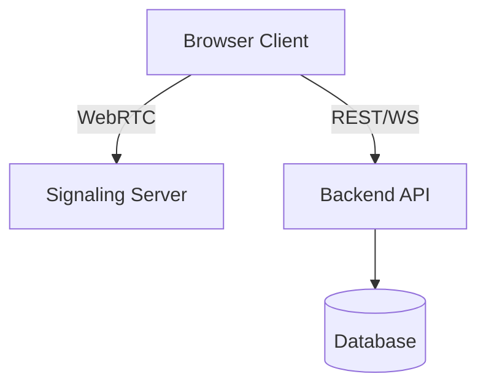

# Getting Started

## Overview

CHATTA! is a WebRTC-based chat client supporting real-time messaging, threads, DMs, and per-user access protections.

## Prerequisites

- Node.js 20+
- A WebRTC-compatible browser

## Running Locally

```bash
# Backend
cd backend
# follow backend setup instructions

# Frontend
cd frontend
npm install
npm run dev
```

## Features

- Send, edit, and delete messages in real time
- Create and browse message threads
- Direct messages (DMs) between users
- Per-user access protections on channels and DMs
- View message history across all channels

## Architecture


